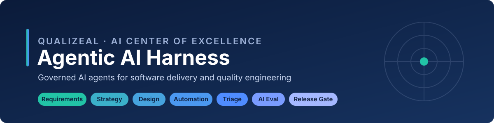
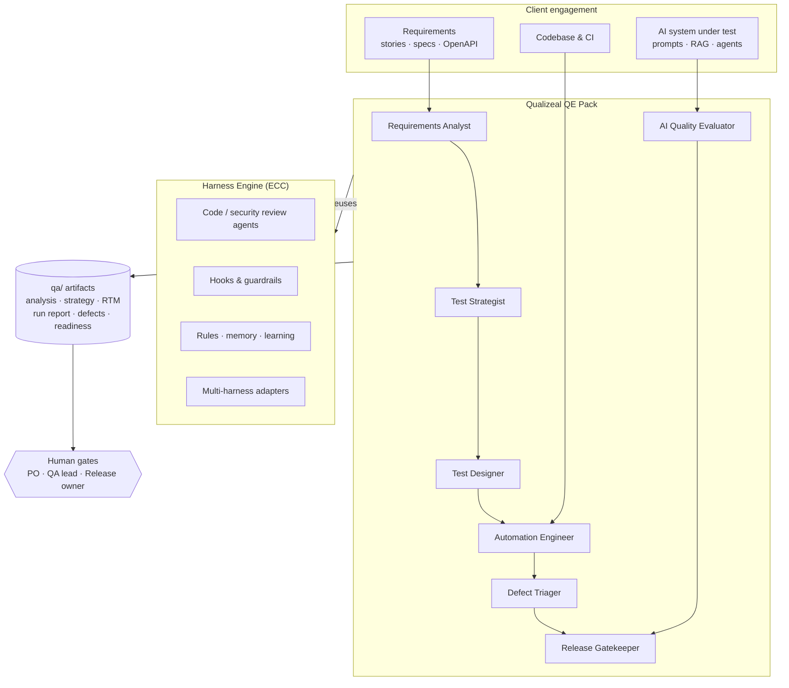

<p align="center">
  
</p>

# Qualizeal Agentic AI Harness

**Governed AI agents for software delivery and quality engineering — built by
the Qualizeal AI Center of Excellence.**

AI coding agents are fast, but speed without verification is risk. The
Qualizeal Agentic AI Harness wraps agents such as Claude Code, Kiro, Codex,
Cursor, and GitHub Copilot in an engineering operating model: they plan before
they build, test what they change, triage what fails, and produce the
evidence a release decision needs — with humans approving at every gate.

```text
requirements -> strategy -> test design -> automation -> triage -> AI evaluation -> release gate
```

## What's inside

| Layer | What it gives you | Size |
| --- | --- | --- |
| **Qualizeal QE Pack** (`qualizeal-qe/`) | Agentic STLC: requirements testability, risk-based strategy, technique-driven test design, automation, defect triage, LLM/agent evaluation, release gating | 7 agents · 8 skills · 8 commands |
| **Harness Engine** (`engine/`) | Planning, TDD, code review, security review, build repair, hooks, rules, memory, continuous learning, AgentShield scanning, multi-harness adapters | 68 agents · 286 skills · 94 commands |
| **Demo kit** (`demo/`) | A banking API with seeded defects, feature spec, AI-assistant eval dataset, and a facilitator answer key | 15-minute live demo |

The engine is the open-source [ECC](https://github.com/affaan-m/ECC) harness
(MIT), vendored as a git subtree so Qualizeal can take upstream improvements
while keeping its own layer separate. See [NOTICE.md](NOTICE.md).

## Why clients care

- **Evidence, not vibes.** Every phase writes a reviewable artifact under
  `qa/`, with stable IDs linking requirements -> risks -> test cases -> tests
  -> defects -> release decision.
- **Human-in-the-loop by design.** Agents stop at gates for product owner, QA
  lead, and release owner decisions; `--auto` mode records assumptions instead.
- **Systematic, not happy-path.** Test design names its technique (boundary
  values, decision tables, state transitions, error guessing), so coverage is
  explainable to auditors.
- **AI systems tested like any system.** Golden and adversarial datasets,
  rubric scoring, thresholds, and a PASS / CONDITIONAL / FAIL verdict for
  chatbots, RAG pipelines, and agents.
- **Guardrails built in.** Agents never weaken assertions to get green, never
  skip tests, and never silently fix product code; the engine adds hook-based
  safety checks and configuration scanning.
- **Tool-agnostic.** Runs in Claude Code natively; installs into Kiro and
  Codex projects; skills are plain Markdown any agent can read.

## Architecture



Details: [docs/ARCHITECTURE.md](docs/ARCHITECTURE.md).

## Quick start

### Claude Code (plugin marketplace)

```text
/plugin marketplace add prashobh-ai/AgenticAI-Harness
/plugin install qualizeal-qe@qualizeal-harness
/plugin install ecc@qualizeal-harness        # optional: full harness engine
```

Then, in any project:

```text
/qz-stlc docs/feature-spec.md --auto
```

### Project install (Claude Code, Kiro, Codex)

```bash
git clone https://github.com/prashobh-ai/AgenticAI-Harness.git
cd AgenticAI-Harness

node scripts/qz.js install --target claude --dest /path/to/project   # .claude/agents, skills, commands
node scripts/qz.js install --target kiro   --dest /path/to/project   # .kiro/agents, skills, steering
node scripts/qz.js install --target codex  --dest /path/to/project   # .agents/skills
```

Existing files are never overwritten without `--force`; use `--dry-run` to preview.
For the engine's own installers (profiles, hooks, other harnesses) see
[engine/README.md](engine/README.md).

## Commands

| Command | Agent | Output |
| --- | --- | --- |
| `/qz-stlc` | all, in sequence | every artifact below, with gates |
| `/qz-analyze-requirements` | `qz-requirements-analyst` | `qa/01-requirements/analysis.md` |
| `/qz-test-strategy` | `qz-test-strategist` | `qa/02-strategy/test-strategy.md` |
| `/qz-design-tests` | `qz-test-designer` | `qa/03-design/test-cases.md`, `rtm.md` |
| `/qz-automate` | `qz-automation-engineer` | tests + `qa/05-execution/run-report.md` |
| `/qz-triage` | `qz-defect-triager` | `qa/05-execution/defects/DEF-*.md` |
| `/qz-ai-eval` | `qz-ai-quality-evaluator` | `qa/ai-eval/eval-report.md` |
| `/qz-release-gate` | `qz-release-gatekeeper` | `qa/06-release/readiness.md` |

Engine commands such as `/plan`, `/tdd`, `/code-review`, and
`/security-review` remain available alongside these.

## See it in 15 minutes

`demo/sample-app` is a funds-transfer API whose test suite is **green** — and
which still has four real defects. The harness finds them from the spec alone.

```bash
npm run demo:start                 # API on http://localhost:3000
# in Claude Code, from the repo root:
/qz-stlc demo/requirements/funds-transfer.md --target demo/sample-app --auto
/qz-ai-eval demo/ai-eval
```

Script, timings, and talking points: [docs/DEMO-PLAYBOOK.md](docs/DEMO-PLAYBOOK.md).

## Repository layout

```text
.claude-plugin/marketplace.json   Plugin marketplace: qualizeal-qe + ecc engine
qualizeal-qe/                     Qualizeal QE pack (agents, skills, commands, templates)
engine/                           ECC harness engine (git subtree, kept pristine)
demo/                             Demo app, spec, AI-eval dataset, facilitator notes
docs/                             Architecture, demo playbook, upstream sync
scripts/qz.js                     Validate and install the QE pack
scripts/sync-upstream.sh          Pull the latest engine from upstream
tests/                            Tests for the Qualizeal layer
```

## Development

```bash
npm test               # validate the QE pack, CLI tests, demo app tests
npm run test:engine    # upstream engine suite
npm run sync:upstream  # update engine/ from ECC upstream
```

Contributing to the Qualizeal layer: [CLAUDE.md](CLAUDE.md). Upstream
process: [docs/UPSTREAM-SYNC.md](docs/UPSTREAM-SYNC.md).

## Licensing and attribution

The Qualizeal layer (everything outside `engine/`) is © Qualizeal. The
harness engine in `engine/` is ECC by Affaan Mustafa, used under the MIT
License, with its copyright and license notice retained in
[engine/LICENSE](engine/LICENSE). See [NOTICE.md](NOTICE.md).
