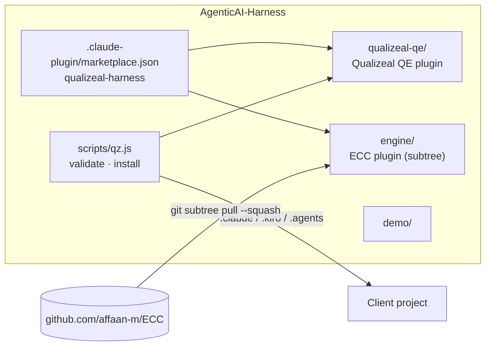
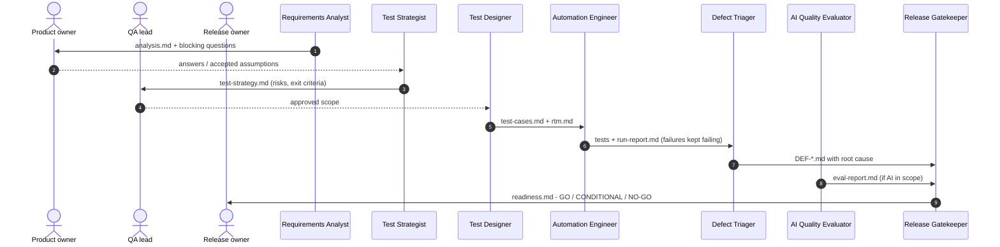

# Architecture

## Design goals

1. **Qualizeal-owned surface, upstream-powered core.** Clients see a Qualizeal
   product; the engine keeps improving upstream without fork drift.
2. **Artifacts as the contract between agents.** Every phase reads and writes
   files under `qa/`, so any phase can be re-run, reviewed, or audited.
3. **Humans decide; agents prepare evidence.** Gates are explicit, and agents
   may propose but never grant waivers.
4. **Portable.** Plain-Markdown agents and skills, installable into Claude
   Code, Kiro, and Codex projects.

## Layers



| Layer | Ownership | Change policy |
| --- | --- | --- |
| `qualizeal-qe/` | Qualizeal | Free to change; validated by `scripts/qz.js validate` |
| `engine/` | Upstream ECC (MIT) | **Do not edit.** Update only via `npm run sync:upstream` |
| Root docs, demo, scripts | Qualizeal | Free to change |

Keeping `engine/` pristine means an upstream sync is a clean subtree merge.
If the engine truly needs a change, contribute it upstream, or add an override
in `qualizeal-qe/` (a Qualizeal skill or agent that supersedes the behaviour).

## The agentic STLC



### Artifact layout (in the project under test)

```text
qa/
  01-requirements/analysis.md
  02-strategy/test-strategy.md
  03-design/test-cases.md
  03-design/rtm.md
  03-design/features/*.feature        (optional)
  05-execution/run-report.md
  05-execution/defects/DEF-001.md
  ai-eval/eval-report.md
  06-release/readiness.md
```

### Identifier scheme

| Prefix | Meaning | Created by |
| --- | --- | --- |
| `US-*` / `REQ-*` | Requirement (reuse source IDs) | Analyst |
| `Q-*` | Open question / assumption | Analyst |
| `R-*` | Risk | Strategist |
| `TC-*` | Test case (also in automated test names) | Designer |
| `DEF-*` | Defect | Triager |

## Guardrails

| Risk | Control |
| --- | --- |
| Agent "fixes" tests to match buggy behaviour | Automation agent may not change expected results without a requirement or confirmed assumption; failing tests are handed to triage |
| Agent hides failures | Never skip, disable, or delete tests; run report lists every failure |
| Silent product changes | QE agents do not modify product code |
| Invented business rules | Assumptions are labelled and routed to a human gate |
| Prompt injection via specs, transcripts, logs | All inputs treated as data; engine prompt-defense baseline and hooks |
| Flaky-label abuse | "Flaky" requires timing/ordering evidence and an owner |
| Ungrounded release decisions | Gatekeeper cites evidence for every criterion; numbers must reconcile |

## Model routing

Judgement-heavy agents (strategist, AI evaluator, release gatekeeper) default
to `opus`; high-volume agents (analyst, designer, automation, triage) default
to `sonnet`. Override per engagement in the agent frontmatter.

## Extending

- **New agent or skill:** add it under `qualizeal-qe/` with the `qz-` prefix;
  `npm test` validates frontmatter, cross-references, and name collisions with
  the engine.
- **Client-specific packs:** copy `qualizeal-qe/` to `packs/<client>/`, add it
  to `marketplace.json`, and keep client data out of this repository.
- **Tool integrations** (Jira, Azure DevOps, TestRail, Xray): add MCP servers
  in the client project and reference them from the relevant agent; the engine's
  `mcp-configs/` has examples.
